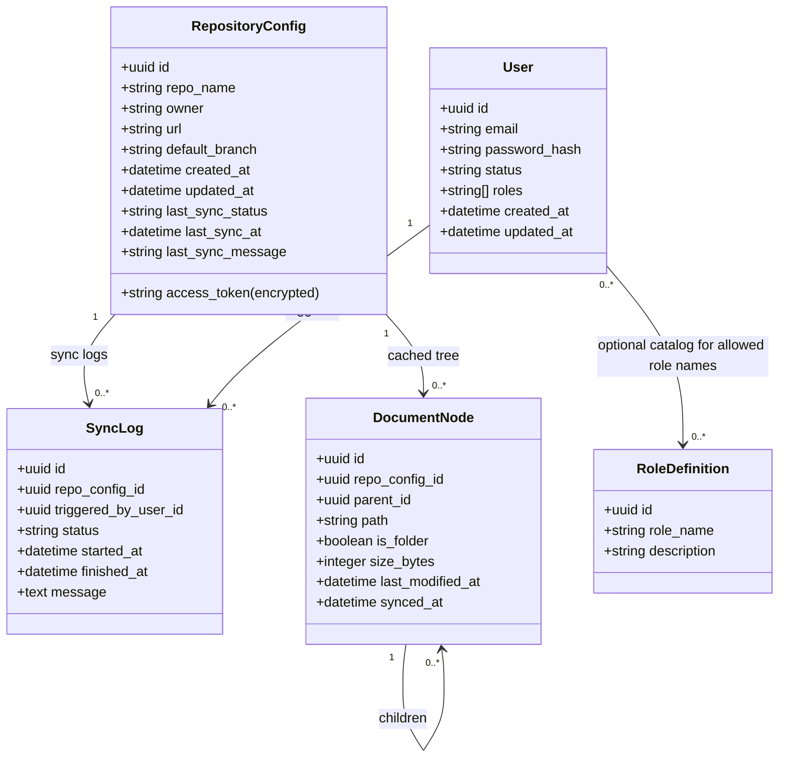

# Lot 1 Scope and Deliverables
First delivery focuses on making the Symfony app a secure control plane for GitHub-backed RAG assets: connect a repo, synchronize its files, expose a tree view per user, and manage roles.

## Objectives
- Establish **reliable GitHub connectivity** with stored credentials and repository metadata.
- Enable **document synchronization** with clear status and timestamps.
- Provide a **secure tree view** of the repository, gated by authenticated users and roles.
- Set up **user and role management** in the database for controlled access.

## Functional Scope
- **GitHub connection & sync**
  - Store access token, repo name, owner/org, URL, default branch; validate connectivity on save.
  - Trigger manual sync; schedule recurring sync (scope of cadence to be defined); capture last sync status (success/fail) and timestamp.
  - Pull repository tree and file metadata; flag sync gaps or permission issues.
- **Credential and repository metadata management**
  - Create/update/delete GitHub access tokens and repo settings in database with audit fields (creator, timestamps).
- **Document tree display**
  - Render repository structure as an **expandable tree**; show basic metadata (path, size, last modified from GitHub).
  - Protect display behind authenticated sessions; only authorized roles can view or trigger sync.
- **User and role management**
  - CRUD for users; assign roles (e.g., **Admin**, **Editor**, **Viewer**).
  - Enforce role-based permissions for syncing, editing credentials, and viewing trees.

## Data Model (initial)
- **RepositoryConfig**: id, repo_name, owner, url, default_branch, access_token (secured), created_at, updated_at, last_sync_status, last_sync_at, last_sync_message.
- **User**: id, email/login (user identifier), password hash, **roles (string[])** per Symfony Security, status, created_at, updated_at.
- **RoleDefinition (optional catalog)**: id, role_name, description (used to curate allowed role strings stored on users).
- **SyncLog** (optional for Lot 1 MVP): id, repo_config_id, status, started_at, finished_at, message.

## Access and Security
- Auth required for all features; session management via Symfony security stack.
- Access tokens stored encrypted at rest; restrict visibility in UI (never fully shown after save).
- Role gating (roles are stored as strings on the User entity):
  - **Admin**: manage credentials, users/roles, trigger sync, view tree.
  - **Reviewer**: view tree, view sync status, trigger sync.
  - **Viewer**: read-only tree and sync status.

## Workflows (Lot 1)
1. **Configure repository**: Admin sets token + repo info; system validates connectivity and persists config.
2. **Sync documents**: Authorized user triggers sync; system pulls latest tree, records status/time, updates tree cache.
3. **Browse tree**: Authenticated user opens tree view; system returns cached structure with metadata.
4. **Manage users/roles**: Admin creates users, assigns roles; permissions enforced across UI/actions.

## Success Criteria
- A GitHub repo can be configured and validated; invalid tokens are rejected gracefully.
- Sync can be triggered; last sync status and timestamp are visible.
- Repository tree renders for authenticated users; unauthorized users are blocked.
- Roles effectively limit who can edit credentials, trigger sync, or view documents.

## Class Diagram (Data Model)

- Diagram aligns to Symfony Security: `roles` are stored on the User entity as strings; optional `RoleDefinition` catalogs allowed values without breaking `UserInterface`. Credentials remain encrypted, and logs capture who triggered a sync. Document nodes store folder/file hierarchy for secure display without re-calling GitHub on every view.
