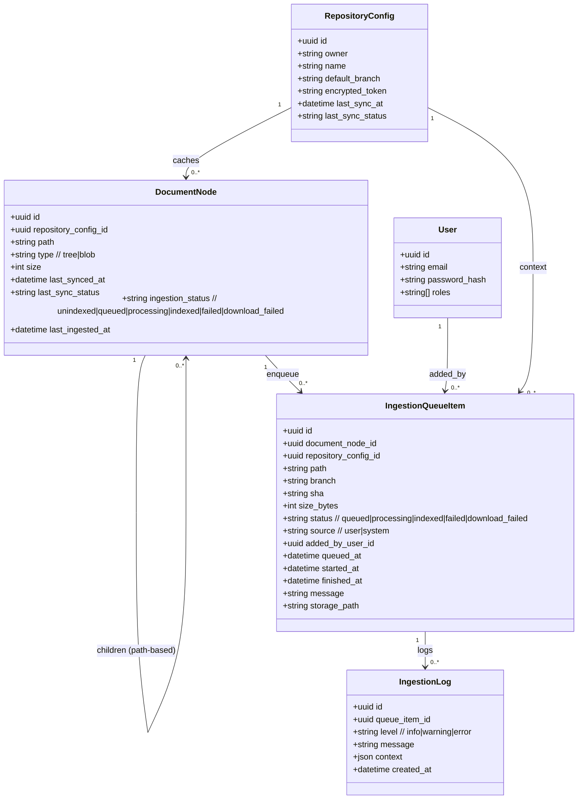

# Lot 2 - Functional Scope and Data Model

Second delivery extends the control plane with ingestion queuing for the RAG pipeline, UI actions to enqueue documents, and status/log visibility directly from the repository tree.

## Objectives
- Expose a **file d’attente** (queue) of documents to ingest for RAG, persisted in MySQL.
- Allow enqueueing documents from the tree/list views with clear feedback and duplicate protection.
- On enqueue, **download the file from GitHub** and store it in the configured shared directory for the RAG worker.
- Display **color/status** distinctions in tree and table: folders, non-indexed, queued, processing, indexed, failed.
- Provide **per-document logs** to trace ingestion outcomes (read/write by the external RAG worker).

## Workflows (functional)
1) **Ajouter à la file**  
   - From tree/table, user clicks “Ajouter à la file” on a file (not folders).  
   - If already queued/processing/indexed, show info and prevent duplicates; allow “Ré-indexer” if needed.  
   - System creates a queue item, downloads the file from GitHub (default branch from config), writes it to `rag_shared_dir`, sets status `queued` (or `download_failed`), and emits a UI toast/flash.

2) **Traitement RAG (process externe)**  
   - RAG worker polls queue items with status `queued`, sets `processing`, ingests, writes `ingestion_log` entries, then sets `indexed` or `failed` with message and timestamps.

3) **Visualisation des statuts**  
   - Tree/table render badges and colors from the latest known state (`ingestion_status` on document or derived from latest queue item).  
   - Detail panel shows last attempt, size, branch, and a link to logs.

4) **Relance**  
   - If `failed` or `download_failed`, user can retry: create a new queue item or reset status to `queued` with an audit of who triggered it.

## Status model and colors (UI)
- `directory`: neutral (folder icon).
- `unindexed`: grey/secondary.
- `queued`: yellow/orange.
- `processing`: blue.
- `indexed`: green.
- `failed` / `download_failed`: red.

## Error and validation rules
- If GitHub download or filesystem write to `rag_shared_dir` fails → `download_failed` + log entry with message.
- Enforce max size and optional extension whitelist; refuse with user-facing message.
- Prevent concurrent duplicates for `queued`/`processing` states.

## Roles and permissions
- Enqueue allowed to roles permitted to sync (e.g., Admin/Reviewer).  
- Viewing statuses/logs allowed to any role with tree access.  
- Paths written to `rag_shared_dir` must be sanitized to avoid path traversal.

## Data model (MySQL, shared with RAG)
- `ingestion_queue_item`  
  - id, document_node_id (FK), repository_config_id (FK)  
  - path, branch, sha (optional), size_bytes  
  - status enum: queued | processing | indexed | failed | download_failed  
  - source enum: user | system  
  - added_by_user_id (nullable FK), queued_at, started_at, finished_at  
  - message (nullable), storage_path (path in `rag_shared_dir`)

- `ingestion_log`  
  - id, queue_item_id (FK)  
  - level enum: info | warning | error  
  - message, context (json), created_at

- `document_node` (existing)  
  - add `ingestion_status` enum (aligned with above) and `last_ingested_at` (datetime) for quick rendering; keep existing sync fields.

- `user` (existing)  
  - used to stamp `added_by_user_id` on queue items.

### Data model

