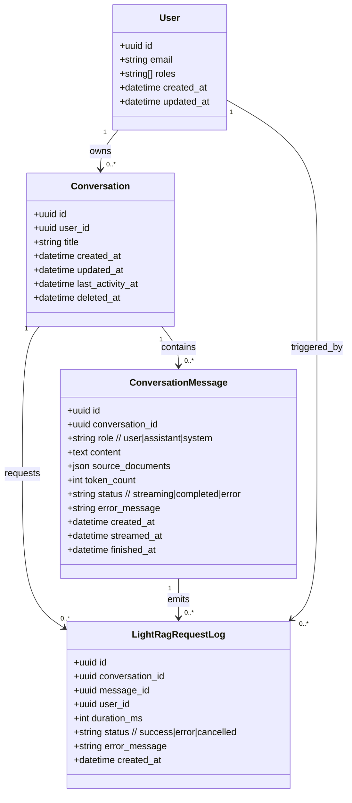

# Lot 4 – Streaming RAG Chat
Fourth delivery adds a conversational UI available to every authenticated user. Chats are persisted per user in MySQL, and answers are streamed from LightRag Server (`/query/stream`) through a Symfony SSE bridge for real-time display.

## Objectives
- Provide a **chat interface** accessible to all connected users, regardless of role.
- Persist **conversations and messages** in MySQL so history is reusable as context.
- Stream answers from **LightRag Server** via `/query/stream` and expose them to the UI through Symfony SSE.
- Combine **RAG results + LLM generation** with the stored history to produce contextual answers.
- Offer clear **statuses, errors, and retry** controls for streaming queries.

## Functional scope
- **Access & permissions**
  - Chat entry point visible to any authenticated user (`ROLE_USER` and up). No role-based restriction on creating conversations.
  - Data isolation: a user only sees their own conversations/messages.
  - Rate limiting on question submission to avoid API flooding (per user, short window).

- **Conversation workspace**
  - Left pane: list of user conversations with title, last activity date, unread/error indicator. “Nouvelle discussion” action starts a new thread.
  - Right pane: chat thread (user + assistant messages) with avatars/badges (`User`, `RAG`). Messages show timestamps and streaming state.
  - Conversation title auto-derived from first user message (with optional manual rename).
  - Delete/archive conversation: moves to soft delete, hides from list; history kept for audit unless hard deletion is required later.

- **Persistence (MySQL)**
  - `conversation`: id (UUID/int), user_id (FK), title, created_at, updated_at, last_activity_at, deleted_at (nullable).
  - `conversation_message`: id, conversation_id (FK), role enum (`user|assistant|system`), content (text/JSON for blocks), source_documents (json nullable for RAG citations), token_count (nullable), status enum (`streaming|completed|error`), error_message (nullable), created_at, streamed_at/finished_at.
  - Indexes: user_id + last_activity_at for list ordering; conversation_id + created_at for thread retrieval.

- **LightRag integration (`/query/stream`)**
  - When a user sends a prompt, backend calls `POST /query/stream` on LightRag Server (http://localhost:9621/docs) with the prompt plus optional retrieved history (latest N messages) as context.
  - Stream handling: LightRag stream is consumed server-side; chunks are forwarded to the UI via SSE while being appended to the `assistant` message buffer.
  - On stream end, the completed assistant message is persisted (status `completed`) with any metadata returned by LightRag (citations/snippets if provided).
  - Timeouts/network errors mark the message `error`, store the error, and stop SSE with a terminal event.

- **Symfony SSE bridge**
  - Use Symfony 7.3 Server-Sent Events to expose a `/sse/chat/{conversationId}/{messageId}` (path indicative) that multiplexes LightRag tokens to the browser.
  - Event types: `token` (partial text), `sources` (optional citations payload), `done` (stream completed), `error` (message + code). Keep-alive comments to avoid proxy timeouts.
  - Cancellation: if user cancels, stop downstream stream and persist message as `error` with reason `cancelled_by_user`.

- **Context management**
  - For each new prompt, load the latest messages of the conversation (configurable cap, e.g., last 20) and format them for LightRag/LLM.
  - Ensure ordering by created_at; skip system/deleted messages when building context if flagged.
  - Conversations created without history start with an optional system primer to ground responses (e.g., project scope).

- **UI behaviors**
  - Sending state: disable send button while a prompt is in-flight; show spinner and token counter.
  - Streaming display: assistant bubble updates in real time; final text replaces the streaming buffer on `done`.
  - Error display: show inline error banner in the thread with retry action (resend last prompt).
  - Empty state: show guidance text and “Nouvelle discussion” CTA when user has no conversations.

- **Audit and observability**
  - Log each request to LightRag with conversation_id, user_id, duration, success/error.
  - Store token counts and optional cost metrics if exposed by LightRag for later reporting.
  - Basic metrics: number of conversations per user, average response latency, error rate.

## Class diagram (data model)

## Workflows
1) **Créer une nouvelle discussion**  
   - User clicks “Nouvelle discussion”.  
   - Backend creates `conversation` (owner = current user) and starts an empty thread.  
   - UI opens the chat area ready for the first prompt.

2) **Poser une question et recevoir la réponse en streaming**  
   - User types a prompt and hits send.  
   - Backend stores a `user` message, prepares context from previous messages, calls LightRag `/query/stream`.  
   - SSE stream begins: UI displays partial tokens; on completion, assistant message is saved with `completed` status (or `error` if failed).  
   - UI shows sources/citations if provided; errors are surfaced with retry.

3) **Reprendre une discussion existante**  
   - User selects a conversation from the list.  
   - Thread loads last messages; user sends a new prompt.  
   - Same streaming flow applies, reusing history for context.

## UX and error rules
- Network/SSE failure: show a non-blocking banner with “Réessayer” to reopen the stream; keep the last known assistant content in the thread.
- Timeout to LightRag (configurable, e.g., 60s): abort stream, mark message `error`, notify the user.
- If LightRag returns validation errors, surface the message and allow editing/resubmission of the prompt.
- UI must avoid duplicate sends on double-click/Enter; debounce input and lock send action until the current stream closes.
- Loading states: skeleton for conversation list; spinner for initial thread fetch; progress for streaming.

## Acceptance criteria
- Any authenticated user can start a chat, see their own history, and continue conversations; other users’ threads are not visible.
- Messages (user + assistant) persist in MySQL with correct ordering and statuses (`streaming`, then `completed` or `error`).
- Streaming works end-to-end: LightRag `/query/stream` tokens arrive at the frontend via Symfony SSE with graceful cancellation and keep-alives.
- On LightRag/API failure, UI shows an error and stored message reflects the error state; retry is possible without data loss.
- Conversation list orders by last activity and updates immediately after each exchange; new conversations start blank and are titled automatically.
