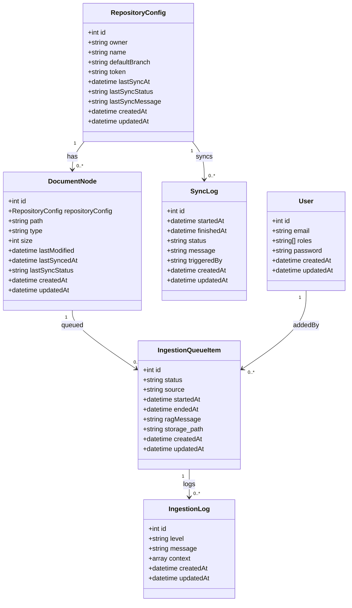

# Entities Class Diagram

```mermaid
classDiagram
  class RepositoryConfig {
    +int id
    +string owner
    +string name
    +string defaultBranch
    +string token
    +datetime lastSyncAt
    +string lastSyncStatus
    +string lastSyncMessage
    +datetime createdAt
    +datetime updatedAt
  }

  class DocumentNode {
    +int id
    +RepositoryConfig repositoryConfig
    +string path
    +string type
    +int size
    +datetime lastModified
    +datetime lastSyncedAt
    +string lastSyncStatus
    +datetime createdAt
    +datetime updatedAt
  }

  class IngestionQueueItem {
    +int id
    +string status
    +string source
    +datetime startedAt
    +datetime endedAt
    +string ragMessage
    +string storage_path
    +datetime createdAt
    +datetime updatedAt
  }

  class IngestionLog {
    +int id
    +string level
    +string message
    +array context
    +datetime createdAt
    +datetime updatedAt
  }

  class SyncLog {
    +int id
    +datetime startedAt
    +datetime finishedAt
    +string status
    +string message
    +string triggeredBy
    +datetime createdAt
    +datetime updatedAt
  }

  class User {
    +int id
    +string email
    +string[] roles
    +string password
    +datetime createdAt
    +datetime updatedAt
  }

  RepositoryConfig "1" --> "0..*" DocumentNode : has
  DocumentNode "1" --> "0..1" IngestionQueueItem : queued
  IngestionQueueItem "1" --> "0..*" IngestionLog : logs
  User "1" --> "0..*" IngestionQueueItem : addedBy
  RepositoryConfig "1" --> "0..*" SyncLog : syncs
```
